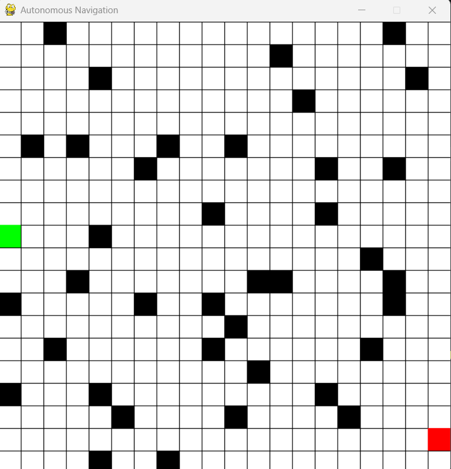
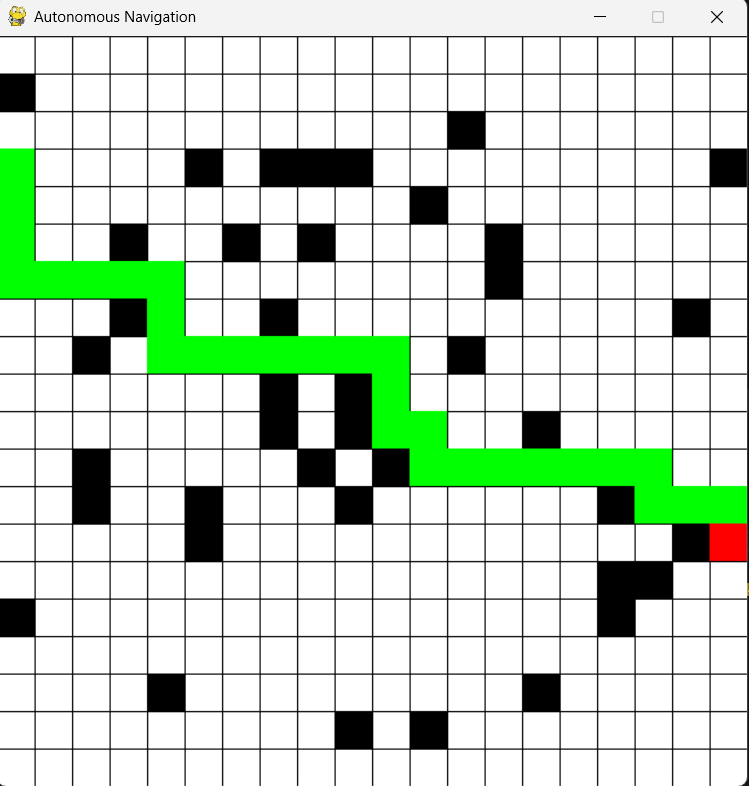

# 🚗 AI-Based Autonomous Navigation System

## 📌 Overview
This project simulates an AI-based autonomous navigation system using a grid-based environment. It uses path planning algorithms to navigate from a start point to a goal while avoiding obstacles.

---

## 🎯 Problem Statement
Autonomous systems like robots and self-driving cars need to navigate safely in unknown environments. This project demonstrates how AI can solve navigation problems using path planning techniques.

---

## 🧠 Features
- Grid-based simulation environment
- Obstacle avoidance
- A* path planning algorithm
- Real-time visualization using pygame
- Simple and beginner-friendly implementation

---

## 🛠️ Tech Stack
- Python
- Pygame
- NumPy

---

## 🏗️ Project Structure

```
AI-Autonomous-Navigation-System/
│
├── simulation/
│   └── environment.py
│
├── src/
│   ├── navigation.py
│   └── path_planning.py
│
├── assets/
|   └── screenshots/
|       └── demo/
│   
│
├── outputs/
│   ├── images/
│   └── videos/
│
├── docs/
│   └── architecture.md
│
├── main.py
├── README.md
├── requirements.txt
└── .gitignore
```

---

## ⚙️ Installation

```bash
git clone <your-repo-link>
cd AI-Autonomous-Navigation-System

python -m venv venv
venv\Scripts\activate

pip install -r requirements.txt
```

---

## ▶️ How to Run

```bash
python main.py
```

---

## 🎮 Controls
- Left Click → Set Start and End point
- Path is generated automatically after selecting points

---

## 📸 Output

### 🔹 Empty Grid


### 🔹 Start & End Selection


### 🔹 Final Path Output


---

## 🚀 Future Improvements
- Add dynamic obstacles
- Integrate OpenCV for real-time detection
- Upgrade to 3D simulation (CARLA)
- Implement advanced AI algorithms

---

## 🤖 Virtual Simulation Implementation

### 📌 Simulator Used
This project uses **Pygame**, a Python-based 2D simulation environment, to visualize autonomous navigation.

---

### 🎯 Why Pygame?
- Lightweight and beginner-friendly  
- Easy grid-based visualization  
- No need for real hardware  
- Fast and interactive simulation  

---


## 🗺️ Environment / Map

The environment is a 2D grid system

Each cell represents:

- White → Free space

- Black → Obstacle


---

## 🤖 Virtual Agent (Robot)

- Green cell → Start point

- Red cell → Goal point

- Agent moves automatically from start to goal


---

## 🚧 Obstacle Placement

- Obstacles are predefined in the grid

- Represent blocked paths

- Agent cannot pass through them


---

## 🧠 AI Environment Reading

- Grid stored as a 2D array (matrix)

- 0 → Free space

- 1 → Obstacle

- Algorithm checks neighboring cells


---

## 🛣️ Path Planning Algorithm

- Uses A* (A-Star) algorithm

- Calculates shortest and optimal path

- Combines:

- Actual cost (g)

- Heuristic cost (h)


---

## 🛑 Collision Avoidance

Avoids obstacle cells

Selects only valid paths

Ensures safe navigation


---

## 🚶 Navigation Process

- Path generated step-by-step

- Agent follows computed path

- Moves from start → end


---

## 📊 Output Visualization

🟩 Green → Start

🟥 Red → End

⬛ Black → Obstacles

Path → Highlighted route


---

## 🔄 Simulation Workflow

1. Run the program


2. Select start point


3. Select end point


4. Press SPACE


5. Path is generated


6. Agent moves to destination


---

## 📸 Screenshots (Proof)

- Empty grid

- Start point selected

- End point selected

- Final path output


---

## 🎥 Video Recording

Simulation execution

Start to end navigation

Path movement visualization


---

## 📂 Output Files

Screenshots → assets/screenshots/

Videos → assets/screenshots/demo/


---

## ✅ Conclusion

This project successfully demonstrates an AI-based autonomous navigation system using virtual simulation. It provides a strong foundation for real-world applications such as robotics and self-driving vehicles.

---
